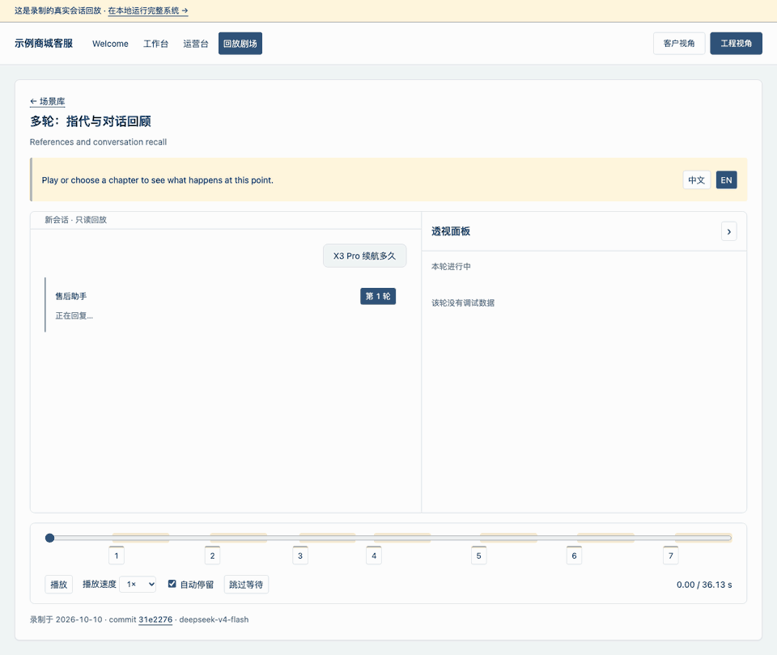
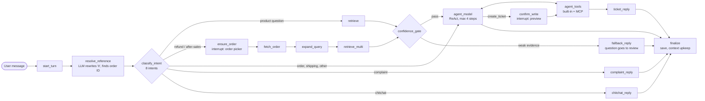
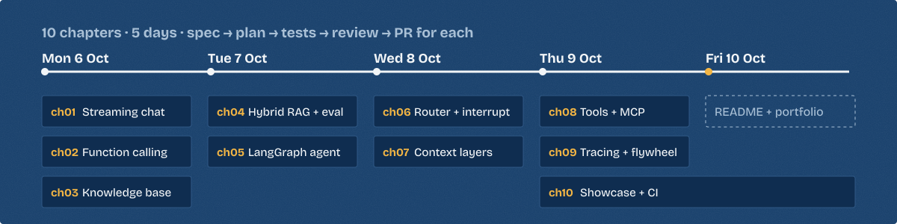

<div align="center">

# Aftersales Agent

**An after-sales support agent that knows when not to answer.**

A LangGraph customer-service agent that cites its sources, refuses when the evidence is weak, and learns from human review.

[](https://github.com/codelformat/Aftersales-agent/actions/workflows/backend.yml)
[](https://github.com/codelformat/Aftersales-agent/actions/workflows/web.yml)
[](https://github.com/codelformat/Aftersales-agent/actions/workflows/pages.yml)
[](LICENSE)

**English** · [简体中文](README.zh-CN.md)

| [▶ Watch the live replay](https://codelformat.github.io/Aftersales-agent/) | [✅ 1,115 backend tests on real MySQL + Milvus in CI](https://github.com/codelformat/Aftersales-agent/actions) | [🧭 Read the decision records](#decision-records) |
|:---:|:---:|:---:|



<sub>A real recorded session, replayed. No reply or debug value in this site is hand-written.</sub>

</div>

**At a glance:** 10 chapters · 5 days (6–10 Oct 2026) · 240+ commits · ~23.5k lines of Python · ~6.2k lines of TypeScript · 3 green CI workflows · 7 recorded scenes on GitHub Pages.

## Contents

[What it does](#what-it-does) · [Architecture](#architecture) · [Measured, not claimed](#measured-not-claimed) · [Decision records](#decision-records) · [What broke and how I fixed it](#what-broke-and-how-i-fixed-it) · [Engineering practices](#engineering-practices) · [How it was built](#how-it-was-built) · [Run it locally](#run-it-locally)

## What it does

The system answers questions for a sample electronics shop: products, orders, shipping, refunds, warranty and complaints. Each row links to a recorded scene.

| Capability | What happens | See it |
|---|---|---|
| Intent routing | An LLM classifies each message into 8 intents. Fixed code routes it to one of 5 exits. | [Boundaries](https://codelformat.github.io/Aftersales-agent/#/theater/boundaries?lang=en) |
| Evidence with citations | Hybrid retrieval and a reranker find evidence. The reply cites it as `[1]`, `[2]`. | [Multi-turn](https://codelformat.github.io/Aftersales-agent/#/theater/multi-turn?lang=en) |
| A gate that can say no | A calibrated score checks the evidence before the agent runs. Weak evidence gets a safe reply. | [Gate screenshot](docs/media/gate.png) |
| Knowledge flywheel | Refused questions go to a review queue. An approved answer is indexed and cited next time. | [Flywheel](https://codelformat.github.io/Aftersales-agent/#/theater/flywheel?lang=en) |
| Refund flow with interrupt | If the order is unknown, the graph pauses and shows an order picker. It resumes on the user's choice. | [Refund](https://codelformat.github.io/Aftersales-agent/#/theater/refund?lang=en) |
| Confirm before write | The agent can draft a ticket, but the user must confirm a preview before it is created. | [Ticket](https://codelformat.github.io/Aftersales-agent/#/theater/ticket?lang=en) |
| Pluggable tools (MCP) | Built-in tools and two MCP servers share one execution engine: validation, timeout, retry, audit. | [MCP timeout](https://codelformat.github.io/Aftersales-agent/#/theater/mcp-timeout?lang=en) |
| Layered context | Recent turns stay verbatim, older turns are shortened by rules, and a background job writes summaries. | [Multi-turn](https://codelformat.github.io/Aftersales-agent/#/theater/multi-turn?lang=en) |

The replay site opens with an [English landing page](docs/media/welcome.png). The app UI is in Chinese, because the shop is Chinese. Narration in the theater has a Chinese/English switch.

## Architecture



**Retrieval pipeline:** query rewrite and model-name normalization → Milvus dense (bge-m3) and BM25, Top-50 each → reciprocal rank fusion → `bge-reranker-v2-m3` Top-10 → minimum score 0.20 → confidence gate → evidence ordered so the strongest items sit at the start and end of the prompt.

| Layer | Technology | Why |
|---|---|---|
| API | FastAPI, Server-Sent Events | Async streaming. One event protocol serves the live app and the replay. |
| Orchestration | LangGraph + LangChain | Checkpointed state, `interrupt()` for human-in-the-loop, explicit graph that tests can walk. |
| Model | DeepSeek `deepseek-v4-flash` (OpenAI-compatible) | Low cost, thinking mode, tool calls. Any OpenAI-compatible model can replace it. |
| Retrieval | Milvus 2.6, bge-m3, bge-reranker-v2-m3 | Dense vectors and BM25 (Chinese analyzer) in one collection. Strong consistency. |
| Data | MySQL 8 (SQLAlchemy async), SQLite checkpoints | MySQL is the source of truth. The Milvus index can be rebuilt from it at any time. |
| Tools | MCP (Streamable HTTP), JSON Schema | External tools plug in without code changes. One policy file grants permissions. |
| Observability | Langfuse (self-hosted) | Trace per turn, token cost per intent, evaluation trend. |
| Frontend | React 19, TypeScript, Vite, Playwright | UI state is a pure reduce over the event stream, so live and replay share one code path. |

## Measured, not claimed

All numbers come from the report files in [`evals/reports/`](evals/reports/). The evaluation set has 300 questions: 240 answerable (policies, model-specific, colloquial, multi-part) and 60 unanswerable.

| Retrieval strategy (240 answerable) | Recall@1 | Recall@5 | MRR | Faithfulness |
|---|---:|---:|---:|---:|
| Dense (bge-m3) | 0.844 | 0.985 | 0.969 | 0.933 |
| BM25 | 0.747 | 0.962 | 0.909 | 0.930 |
| Hybrid (RRF) | 0.834 | 0.988 | 0.967 | 0.926 |
| **Hybrid + rerank (production)** | **0.861** | **0.992** | **0.987** | **0.964** |

Source: [`rag_eval_20261009-193611.md`](evals/reports/rag_eval_20261009-193611.md). An LLM judge scores faithfulness. Two runs of the same code differed by about 4 points, so treat differences under that as noise.

**Confidence gate calibration** ([`gate_calibration_20261009-125757.md`](evals/reports/gate_calibration_20261009-125757.md)): a grid search with 5-fold cross-validation chose weights (0.2, 0.3, 0.5) for Top-1 score, share of useful evidence, and the gap between the top two scores. Against the old rule (Top-1 ≥ 0.20), the refusal rate on unanswerable questions rose from 0.450 to 0.583, while 95.4% of answerable questions still pass.

## Decision records

Each record states the problem, the options, the choice, and the evidence.

<details open>
<summary><b>1. A fixed-route workflow around one ReAct agent, not a free agent loop</b></summary>

- **Problem:** A free agent loop is hard to test, and its cost per turn is unbounded.
- **Options:** free tool-calling loop; multi-agent; fixed graph with one agent.
- **Choice:** LangGraph workflow. An LLM classifies intent, but code decides the route. Complaints and chitchat never reach the agent. The agent stops after 4 steps or 16,000 tokens.
- **Evidence:** every exit has graph tests; the intent eval (60 cases) must reach ≥ 90% accuracy and 100% JSON parse rate to pass.
</details>

<details open>
<summary><b>2. Keep the reranker; fusion alone was not enough</b></summary>

- **Problem:** Customers write colloquial Chinese and model names in many forms (`x3pro`, `X3 Pro`).
- **Options:** dense only; BM25 only; hybrid with RRF; hybrid with a reranker.
- **Choice:** hybrid + reranker, with a lexicon that normalizes model names before search.
- **Evidence:** RRF alone did not beat dense (Recall@1 0.834 vs 0.844). The reranker reached 0.861 and the best faithfulness (0.964).
</details>

<details open>
<summary><b>3. A calibrated gate instead of a guessed threshold</b></summary>

- **Problem:** A wrong answer costs more than a polite "I am not sure" in after-sales.
- **Options:** let the agent decide; fixed Top-1 threshold; combined score fitted on data.
- **Choice:** a three-signal score with weights from a grid search, checked with 5-fold cross-validation and an overfitting test.
- **Evidence:** refusal on unanswerable questions 0.450 → 0.583 with ≥ 95% retention. The constants live in `app/config.py` and may change only with a new calibration report.
</details>

<details>
<summary><b>4. Humans approve new knowledge</b></summary>

- **Problem:** Auto-adding LLM answers to the knowledge base can spread one mistake to every later reply.
- **Choice:** refused questions and 👎 feedback enter a review queue with a snapshot of what was retrieved. One serial worker normalizes and de-duplicates them. Only approved answers are indexed.
- **Evidence:** the flywheel scene shows a refusal turn into a cited answer. Evaluation excludes flywheel and mined chunks, so new answers cannot inflate the baseline.
</details>

<details>
<summary><b>5. One execution engine for every tool, and writes need a human</b></summary>

- **Problem:** Tools from MCP servers can be slow, wrong, or unsafe.
- **Choice:** all calls go through `execute_tool_calls`: lookup → JSON Schema validation → write approval → timeout and retry (read tools only) → triage → formatting → audit log. Permissions come only from `config/tools.json`. `create_ticket` runs only after the user confirms a preview, and it is never retried.
- **Evidence:** the MCP timeout scene; the `tool_audit_logs` table records every call with one of 5 statuses.
</details>

<details>
<summary><b>6. MySQL is the source of truth; Milvus is an index</b></summary>

- **Problem:** Two stores drift apart after crashes or schema changes.
- **Choice:** ingestion writes MySQL rows as `pending`. One function writes Milvus by primary-key upsert and marks rows `done`.
- **Evidence:** an interrupted run can restart without duplicates. `build_kb.py --rebuild` recreates the whole collection from MySQL.
</details>

<details>
<summary><b>7. A recorded replay on Pages instead of a public deployment</b></summary>

- **Problem:** A public demo needs API keys, a budget and abuse protection.
- **Choice:** record real sessions from the running system and replay them in a static site. The full system runs locally with one Docker command.
- **Evidence:** each recording keeps its date, model, git commit and raw events. A Playwright test fails if the replay site requests anything other than its own static files.
</details>

## What broke and how I fixed it

Real incidents from the development notes (in Chinese, under [`dev-notes/`](dev-notes/)).

1. **Tests passed only because of a proxy.** When an MCP server stopped, calls failed with a 502 from somewhere else. The shell had `HTTP_PROXY` set and no `NO_PROXY`, so even `127.0.0.1` traffic went through the proxy. The tests passed because the proxy forwarded them. Fix: local MCP clients use `trust_env=False`, plus a test with a broken proxy. ([ch08](dev-notes/ch08.md))
2. **"Postage" vs "shipping fee".** The question "邮费多少钱" (postage) scored 0.171 against the right chunk, below the threshold. "运费多少钱" (shipping fee) scored 0.796. Fix: the reranker sees the query with colloquial words mapped to standard terms. The score rose to 0.795. ([ch04](dev-notes/ch04.md))
3. **A made-up order number passed the check.** The model invented order "100"; the history contained "1001"; a substring match accepted it. Fix: whole-word matching, with the failing test written first. ([ch06](dev-notes/ch06.md))
4. **A lock that never released.** If an error happened after the pre-check but before streaming started, the session lock stayed held, and every later request got 409. Code review found it before release. Fix: the lock lives in a yield dependency and is released in its `finally`. ([ch01](dev-notes/ch01.md))
5. **Tool-call markers in the reply text.** When no tools were bound, DeepSeek sometimes wrote its internal tool-call markup into the answer. Fix: a closing system message, plus a guard that buffers the first 2 characters and raises an error instead of saving the reply. ([CLAUDE.md](CLAUDE.md))
6. **The evaluation was wrong, not the model.** The first faithfulness score was low. About half the cause was the evaluation itself: the judge counted the cautious wording the prompt asks for as made-up facts, and the harness failed every tool except one. Fix: run read-only tools for real in the evaluation, correct the judge prompt, and check the judge on 30 labelled cases (now 30/30) before trusting any score. ([ch04](dev-notes/ch04.md))

## Engineering practices

- **Real dependencies in CI.** GitHub Actions starts MySQL and Milvus and runs 1,115 backend tests. The web workflow runs 317 unit tests and 13 Playwright tests on the replay build.
- **One event contract across languages.** A JSON Schema describes every SSE event. pytest checks the backend against it; Vitest checks the frontend.
- **Retries with exponential backoff only**, through one shared helper. Write tools are never retried.
- **Prompts have their own evaluation sets**: intent (60), multi-turn reference resolution (24 turns), query expansion (15), ticket drafting (12), summaries (10), and judge self-check (30).
- **Debug data is opt-in.** With `debug=false`, the event stream is identical to the version before the debug channel existed; tests enforce this.
- **Known limitations are written down**: 8 open items with cause, decision and proposed fix in [`docs/backlog/`](docs/backlog/README.md).

## How it was built

I built this project in 10 chapters over 5 days. My role was product owner, architect and reviewer. I set the goals, made the product and technology decisions, and approved or corrected every design. AI coding agents did the typing: **Claude Code** turned my decisions into specs and plans and reviewed every diff, and **Codex** wrote the code.



Each chapter followed the same path: brainstorm → written spec → plan → plan review → test-first implementation → code review → pull request. The full trail is in the repository:

- Specs: [`docs/superpowers/specs/`](docs/superpowers/specs/)
- Plans: [`docs/superpowers/plans/`](docs/superpowers/plans/)
- Development notes with my instructions, corrections and every rework: [`dev-notes/`](dev-notes/)
- Project rules the agents must follow: [`CLAUDE.md`](CLAUDE.md)

What directing agents taught me:

- **Specs beat prompts.** A task description must be self-contained: goal, files, interfaces, tests to pass, and what not to touch. Most rework came from gaps in the brief, not from bad code.
- **Verify, do not trust.** An agent once used a GitHub Action version that does not exist; CI caught it. Another recorded its task instructions in the notes as if they were my words; review caught it. Both became rules.
- **Measure before tuning.** Gate constants, token budgets and prompts change only with a report that justifies the change.

## Run it locally

You need Docker, and API keys for an OpenAI-compatible chat model and for SiliconFlow (embeddings and rerank).

```bash
cp .env.example .env        # fill in the model and key values
docker compose --profile full up -d --build --wait
# then open http://127.0.0.1:8000/
```

Development mode, Langfuse and all options: [`docs/run-locally.md`](docs/run-locally.md) (in Chinese).

## Repository layout

```text
app/            FastAPI app: graph, nodes, tools, knowledge, context, flywheel
mcp_servers/    Two MCP servers: logistics (8101) and after-sales (8102)
web/            React + TypeScript frontend: desk, x-ray, ops console, replay theater
evals/          Evaluation scripts and reports
knowledge/      Source documents and the model-name lexicon
db/             MySQL DDL (the only source of table structure)
scripts/        Knowledge base build, mining, recording, snapshots, demos
tests/          Backend tests (pytest)
docs/           Specs, plans, backlog, media
dev-notes/      Development record per chapter
```

## License and contact

MIT. See [LICENSE](LICENSE).

Built by **Sheng (Harry) Guan**, MPhil CSE at CUHK. I am open to LLM and agent engineering roles in Hong Kong and mainland China. [Portfolio](https://github.com/codelformat) · [LinkedIn](https://www.linkedin.com/in/sheng-harry-guan-a9a991280)
