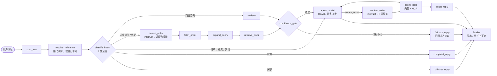

<div align="center">

# Aftersales Agent 电商售后智能客服

**知道什么时候不该回答的售后客服 Agent。**

基于 LangGraph 的客服 Agent：回答带引用；证据不足时拒答；经人工审核持续补充知识。

[](https://github.com/codelformat/Aftersales-agent/actions/workflows/backend.yml)
[](https://github.com/codelformat/Aftersales-agent/actions/workflows/web.yml)
[](https://github.com/codelformat/Aftersales-agent/actions/workflows/pages.yml)
[](LICENSE)

[English](README.md) · **简体中文**

| [▶ 观看在线回放](https://codelformat.github.io/Aftersales-agent/#/theater) | [✅ CI 在真实 MySQL + Milvus 上跑 1,115 个后端测试](https://github.com/codelformat/Aftersales-agent/actions) | [🧭 阅读决策记录](#决策记录) |
|:---:|:---:|:---:|


<sub>真实录制的会话回放。站内所有回复和调试数据都不是手写的。</sub>

</div>

**概览：** 10 章 · 5 天（2026 年 10 月 6–10 日）· 240+ 次提交 · Python 约 2.35 万行 · TypeScript 约 6.2 千行 · 3 条 CI 全绿 · GitHub Pages 上 7 个录制场景。

## 目录

[功能](#功能) · [架构](#架构) · [用数据说话](#用数据说话) · [决策记录](#决策记录) · [翻车与修复](#翻车与修复) · [工程实践](#工程实践) · [开发方式](#开发方式) · [本地运行](#本地运行)

## 功能

系统为一家示例电子产品店回答问题：商品、订单、物流、退款、保修和投诉。每一行都链接到录制场景。

| 能力 | 做什么 | 查看 |
|---|---|---|
| 意图分流 | LLM 把每条消息分为 8 类意图，代码按固定规则分到 5 个出口之一。 | [业务边界](https://codelformat.github.io/Aftersales-agent/#/theater/boundaries) |
| 证据与引用 | 混合检索加重排找到证据，回复用 `[1]`、`[2]` 标注引用。 | [多轮](https://codelformat.github.io/Aftersales-agent/#/theater/multi-turn) |
| 会拒答的闸 | Agent 运行前，校准过的分数先检查证据。证据弱时回安全话术。 | [置信度闸截图](docs/media/gate.png) |
| 知识飞轮 | 拒答的问题进入待审队列。核准的答案入库，下一次回答直接引用。 | [飞轮](https://codelformat.github.io/Aftersales-agent/#/theater/flywheel) |
| 可中断的退款流程 | 订单不明确时，图暂停并弹出订单选择器；用户选择后恢复。 | [退款](https://codelformat.github.io/Aftersales-agent/#/theater/refund) |
| 写操作先确认 | Agent 可以起草工单，但用户确认预览后才创建。 | [工单](https://codelformat.github.io/Aftersales-agent/#/theater/ticket) |
| 即插即用的工具（MCP） | 内置工具和两个 MCP Server 共用一个执行引擎：校验、超时、重试、审计。 | [MCP 超时](https://codelformat.github.io/Aftersales-agent/#/theater/mcp-timeout) |
| 分层上下文 | 最近几轮保留原文，较早的按规则截短，后台任务写分段梗概。 | [多轮](https://codelformat.github.io/Aftersales-agent/#/theater/multi-turn) |

回放站点首页是[英文介绍页](docs/media/welcome.png)，方便不读中文的访客。应用界面为中文；回放剧场的解说可切换中英文。

## 架构



**检索流水线：** 改写与型号归一 → Milvus dense（bge-m3）与 BM25 各 Top-50 → RRF 融合 → `bge-reranker-v2-m3` 取 Top-10 → 最低分 0.20 → 置信度闸 → 首尾排列（最强的证据放在提示词首尾）。

| 层 | 技术 | 选型理由 |
|---|---|---|
| API | FastAPI、Server-Sent Events | 异步流式输出。live 与回放共用一套事件协议。 |
| 编排 | LangGraph + LangChain | State 带 checkpoint；`interrupt()` 支持人在回路；图结构明确，测试能逐条走通。 |
| 模型 | DeepSeek `deepseek-v4-flash`（OpenAI 兼容） | 成本低，支持思考模式和工具调用。可换任意 OpenAI 兼容模型。 |
| 检索 | Milvus 2.6、bge-m3、bge-reranker-v2-m3 | 一个集合同时存 dense 向量和 BM25（中文分词），强一致。 |
| 数据 | MySQL 8（SQLAlchemy 异步）、SQLite checkpoint | MySQL 是唯一权威来源，Milvus 索引随时可从 MySQL 重建。 |
| 工具 | MCP（Streamable HTTP）、JSON Schema | 外部工具不改代码即可接入，权限只看一份策略文件。 |
| 可观测 | Langfuse（自部署） | 每轮 trace、按意图汇总 token、评估趋势。 |
| 前端 | React 19、TypeScript、Vite、Playwright | 界面状态 = 事件序列的纯函数 reduce，live 与回放共用一条代码路径。 |

## 用数据说话

所有数字来自 [`evals/reports/`](evals/reports/) 中的报告文件。评估集共 300 题：240 道可答题（政策、型号、口语、多要点）和 60 道无答案题。

| 检索策略（240 道可答题） | Recall@1 | Recall@5 | MRR | 忠实度 |
|---|---:|---:|---:|---:|
| Dense（bge-m3） | 0.844 | 0.985 | 0.969 | 0.933 |
| BM25 | 0.747 | 0.962 | 0.909 | 0.930 |
| 混合（RRF） | 0.834 | 0.988 | 0.967 | 0.926 |
| **混合 + 重排（生产）** | **0.861** | **0.992** | **0.987** | **0.964** |

来源：[`rag_eval_20261009-193611.md`](evals/reports/rag_eval_20261009-193611.md)。忠实度由 LLM 裁判打分。同一代码两次运行相差约 4 个点，低于这个幅度的差异按噪声处理。

**置信度闸校准**（[`gate_calibration_20261009-125757.md`](evals/reports/gate_calibration_20261009-125757.md)）：网格搜索加 5 折交叉验证，选出 Top-1 分、有效证据占比、Top-1 与 Top-2 分差三项的权重 (0.2, 0.3, 0.5)。与旧规则（Top-1 ≥ 0.20）相比，无答案题的拒答率从 0.450 升到 0.583，可答题仍有 95.4% 通过。

## 决策记录

每条记录写清问题、选项、选择和证据。

<details open>
<summary><b>1. 固定分流的工作流 + 一个 ReAct Agent，不用自由循环</b></summary>

- **问题：** 自由 Agent 循环难测试，每轮成本没有上限。
- **选项：** 自由工具调用循环；多 Agent；固定图 + 一个 Agent。
- **选择：** LangGraph 工作流。LLM 识别意图，代码决定路线。投诉和闲聊不进 Agent。Agent 最多 4 步或 16,000 token。
- **证据：** 每个出口都有图测试；意图评估（60 条）准确率 ≥ 90%、JSON 解析率 100% 才算通过。
</details>

<details open>
<summary><b>2. 保留重排；只做融合不够</b></summary>

- **问题：** 用户写口语中文，型号写法多样（`x3pro`、`X3 Pro`）。
- **选项：** 只用 dense；只用 BM25；混合 + RRF；混合 + 重排。
- **选择：** 混合 + 重排，检索前用词表归一型号。
- **证据：** 只做 RRF 没有超过 dense（Recall@1 0.834 对 0.844）。重排达到 0.861，忠实度最高（0.964）。
</details>

<details open>
<summary><b>3. 用数据校准闸，不拍脑袋定门槛</b></summary>

- **问题：** 售后场景中，答错的代价高于一句"我不确定"。
- **选项：** 让 Agent 自己判断；固定 Top-1 门槛；在数据上拟合组合分数。
- **选择：** 三信号组合分数，权重来自网格搜索，用 5 折交叉验证和过拟合检查复核。
- **证据：** 可答题保留率 ≥ 95% 时，无答案题拒答率 0.450 → 0.583。常量在 `app/config.py`，只有新的校准报告才能改。
</details>

<details>
<summary><b>4. 新知识由人工核准</b></summary>

- **问题：** 自动把 LLM 答案写进知识库，一个错误会扩散到之后的每次回答。
- **选择：** 拒答问题和 👎 反馈带召回快照进入待审队列。单 worker 串行做标准化和查重。只有核准的答案才入库。
- **证据：** 飞轮场景展示了从拒答到带引用回答的全过程。评估排除飞轮块和挖掘块，新答案不会抬高基线。
</details>

<details>
<summary><b>5. 所有工具走同一个执行引擎，写操作必须有人确认</b></summary>

- **问题：** MCP Server 的工具可能慢、可能错、可能不安全。
- **选择：** 所有调用走 `execute_tool_calls`：查找 → JSON Schema 校验 → 写操作确认 → 超时与重试（只限只读工具）→ 分诊 → 格式化 → 审计。权限只来自 `config/tools.json`。`create_ticket` 只在用户确认预览后执行，且从不重试。
- **证据：** MCP 超时场景；`tool_audit_logs` 表记录每次调用，状态共 5 种。
</details>

<details>
<summary><b>6. MySQL 是权威来源，Milvus 只是索引</b></summary>

- **问题：** 崩溃或结构变更后，两个存储会不一致。
- **选择：** 入库只写 MySQL `pending`。由一个函数按主键 upsert 写 Milvus，再回填 `done`。
- **证据：** 中断后重跑不产生重复。`build_kb.py --rebuild` 可从 MySQL 重建整个集合。
</details>

<details>
<summary><b>7. 用 Pages 上的录制回放代替公网部署</b></summary>

- **问题：** 公网演示需要 API 密钥、预算和防滥用。
- **选择：** 从运行中的系统录制真实会话，在静态站点回放。完整系统可用一条 Docker 命令在本地启动。
- **证据：** 每份录制保留日期、模型、git commit 和原始事件。如果回放站点请求了自身静态文件以外的任何资源，Playwright 测试就失败。
</details>

## 翻车与修复

以下是开发记录（[`dev-notes/`](dev-notes/)）中的真实事故。

1. **测试通过，只因为有代理。** MCP Server 停掉后，调用返回来路不明的 502。原因：shell 设了 `HTTP_PROXY`，没有 `NO_PROXY`，连 `127.0.0.1` 的请求也走了代理；测试能过，是代理替我们转发了。修复：本机 MCP 客户端用 `trust_env=False`，并补"代理指向不可连端口"的测试。（[ch08](dev-notes/ch08.md)）
2. **"邮费"和"运费"。** "邮费多少钱"对正确块只得 0.171，低于门槛；"运费多少钱"得 0.796。修复：重排时把口语词替换为标准词，分数升到 0.795。（[ch04](dev-notes/ch04.md)）
3. **编造的订单号通过了校验。** 模型编了订单号"100"，历史里有"1001"，子串匹配放行了它。修复：改为整词匹配，先写失败的测试。（[ch06](dev-notes/ch06.md)）
4. **永不释放的锁。** 预检之后、流式输出开始之前出错，会话锁就一直不释放，之后的请求一律 409。代码审查在上线前发现。修复：锁放在 yield 依赖中，在其 `finally` 释放。（[ch01](dev-notes/ch01.md)）
5. **回复正文里出现工具调用标记。** 不绑定工具时，DeepSeek 偶尔把内部的工具调用标记写进答案。修复：末尾追加收尾 System 消息；另加防线缓冲前 2 个字符，命中即报错、不写库。（[CLAUDE.md](CLAUDE.md)）
6. **错的是评估，不是模型。** 第一轮忠实度偏低，约一半原因在评估本身：裁判把 Prompt 要求的保守措辞判为编造，评估中除一个工具外其他工具都失败。修复：评估中真实执行只读工具，修正裁判 Prompt，并先用 30 条标注样例检验裁判（现为 30/30），再相信分数。（[ch04](dev-notes/ch04.md)）

## 工程实践

- **CI 用真实依赖。** GitHub Actions 启动 MySQL 和 Milvus，跑 1,115 个后端测试。web 工作流跑 317 个单元测试和 13 个 Playwright 测试（针对回放构建）。
- **跨语言的事件契约。** 一份 JSON Schema 描述所有 SSE 事件。pytest 校验后端，Vitest 校验前端。
- **重试一律指数回退**，统一走一个公共函数。写工具从不重试。
- **Prompt 有各自的评估集**：意图（60）、多轮指代消解（24 轮）、Query 扩写（15）、工单起草（12）、摘要（10）、裁判自检（30）。
- **调试数据按需开启。** `debug=false` 时事件流与加入调试通道之前完全一致，有测试保证。
- **已知问题有记录**：8 个搁置问题，各写明现象、根因、决定和建议方案，见 [`docs/backlog/`](docs/backlog/README.md)。

## 开发方式

本项目分 10 章、用 5 天完成。我的角色是产品负责人、架构师和审查者：设定目标，做产品与技术决策，批准或纠正每一份设计。代码由 AI 编码 Agent 完成：**Claude Code** 把我的决策写成 spec 和 plan，并审查每一份 diff；**Codex** 编写代码。


每章走同一条路径：brainstorm → 书面 spec → plan → 计划评审 → 测试先行的实现 → code review → PR。完整记录都在仓库中：

- spec：[`docs/superpowers/specs/`](docs/superpowers/specs/)
- plan：[`docs/superpowers/plans/`](docs/superpowers/plans/)
- 开发记录（含我的原话、纠偏和每一次返工）：[`dev-notes/`](dev-notes/)
- Agent 必须遵守的项目规则：[`CLAUDE.md`](CLAUDE.md)

指挥 Agent 的体会：

- **spec 胜过 prompt。** 任务描述必须自包含：目标、文件、接口、要通过的测试、不许改的范围。大部分返工来自任务描述的缺口，而不是代码写得差。
- **核实，不轻信。** Agent 曾用了一个不存在的 GitHub Action 版本，CI 拦了下来；另一次它把任务指令当成我的原话写进记录，审查发现。两次都变成了规则。
- **先测量再调参。** 闸的常量、token 预算和 Prompt，只有报告支持才能改。

## 本地运行

需要 Docker，以及 OpenAI 兼容聊天模型和硅基流动（嵌入、重排）的 API 密钥。

```bash
cp .env.example .env        # 填写模型参数和密钥
docker compose --profile full up -d --build --wait
# 然后打开 http://127.0.0.1:8000/
```

开发模式、Langfuse 和全部选项见 [`docs/run-locally.md`](docs/run-locally.md)。

## 目录结构

```text
app/            FastAPI 应用：图、节点、工具、知识库、上下文、飞轮
mcp_servers/    两个 MCP Server：物流（8101）、售后（8102）
web/            React + TypeScript 前端：工作台、透视面板、运营台、回放剧场
evals/          评估脚本与报告
knowledge/      源文档与型号词表
db/             MySQL DDL（表结构的唯一来源）
scripts/        建库、挖掘、录制、快照、验收脚本
tests/          后端测试（pytest）
docs/           spec、plan、搁置问题、媒体
dev-notes/      每章的开发记录
```

## 许可与联系

MIT，见 [LICENSE](LICENSE)。

作者 **管昇（Sheng Harry Guan）**，香港中文大学 CSE MPhil。正在寻找香港与中国内地的大模型与 Agent 工程岗位。[作品集](https://github.com/codelformat) · [LinkedIn](https://www.linkedin.com/in/sheng-harry-guan-a9a991280)
